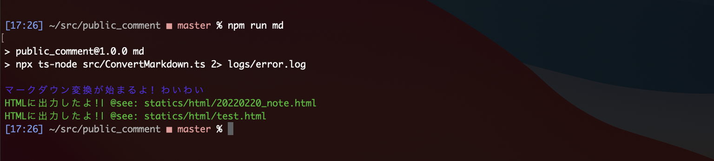

# Public Comment @yusugiura
 
 ## Published Articles

 | published | status | media | title | file |
 | -- | -- | -- | -- | -- |
 | 2022-02-26 | reserved | note | [経営層はコードが読めますか？]() | [20220220_note.md](/articles/20220220_note.md) | 

 account: https://note.com/yutaka_sugiura
 
 ## Usage

 1) Save articles in this public repository by markdown.
 2) You can convert markdown to HTML which is supported [note.com](https://note.com).

 ## Convert from markdown to HTML for posting [note.com](https://note.com)

 - You can convert from markdown to HTML, because [note.com](https://note.com) do not support md.
 - When you post [note.com](https://note.com), execute command `npm run md` by node.js with typescript.



```
// environment settings
npm run install

// execute command
// @convert all articles/*.md files.
npm run md
```

## Notification

 - [note.com](https://note.com) do not support specific HTML tags.

| tag | Is [note.com](https://note.com) supported? | markdown | memo |
| -- | -- | -- | -- |
| `<h1>` | **no** | `# string` | `<h1>` tag is used in article title. |
| `<h2>` | yes | `## string` | |
| `<h3>` | yes | `### string` | |
| `<br>` | yes | `\n` or `<br>` | |
| `<a>` | yes | `[string](URL: string)` | |
| `<b>` | yes | `**string**` | |
| `<strong>` | **no** | `**string**` | |
| `<blockquote>` | yes | `>string` | |
| `<ul> & <li>` | yes | `- string` | |
| `` | yes | | |
| `<p>` | yes | `string` | |
| `<pre>` | yes | | |

 ## Created
  
 - 2022-02-21

 ## Author
 - @yusugiura 
 - [GET] https://the-shashi.com/api/yusugiura.json

